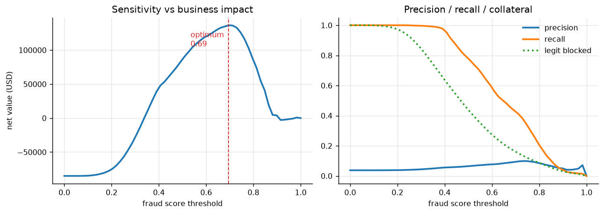

# Reward Attribution Integrity System

> TL;DR (for recruiters / quick scan)

# Reward Attribution Integrity System

**Detects fraudulent mobile-attribution traffic without labels, and translates model output into business decisions.**

Built on ~185M rows of real clickstream data, this system identifies high-risk entities using behavioural anomalies (not conversions), and optimises intervention thresholds based on economic impact.

---

## Key Results

**Synthetic validation (ground truth)**
- ROC-AUC: 0.998  
- PR-AUC: 0.974  
- 97.6% of fraud captured in top 1%

**Real data (TalkingData, proxy labels)**
- ROC-AUC: 0.736  
- PR-AUC: 0.078  
- Precision @ top 1%: ~6%  

---

## Business Outcome

At the recommended operating point:

- Blocks: 573 entities (~0.75% of traffic)  
- Precision: ~6%  
- Legitimate users impacted: 0.72%  
- Estimated value protected: **$792**  

**Design choice:** prioritise catching high-cost fraud over maximising precision.  
False positives tend to be low-activity users; true positives concentrate among high-volume actors driving disproportionate loss.

---

## What Makes This Different

### 1. No label leakage — by design
Detection uses only behavioural signals (timing, diversity, patterns).  
Conversion labels are **strictly excluded** from features and enforced via tests.

---

### 2. Ensemble of complementary detectors
- Clustering → coordinated fleets  
- Timing distribution → bots / scripted behaviour  
- Population drift → actors deviating from baseline  

Scores are rank-normalised and combined to avoid scale dominance.

---

### 3. Decision layer, not just a model
A threshold sweep maximises **net value**, not accuracy:

- Fraud payout: $2  
- False block cost: $5  

This converts model output into a **clear stakeholder decision**.

---

### 4. Real-world constraint: detectability floor
At a 0.17% base conversion rate: ~1,760 clicks required before “0 conversions” is statistically suspicious


Low-volume fraud cannot be proven — only inferred.

→ Explains gap between:
- PR-AUC 0.974 (synthetic truth)
- PR-AUC 0.078 (real proxy)

The model detects behaviour the labels cannot confirm.

---

## System Design

- DuckDB pipeline → processes 200M+ rows out-of-core  
- Airflow DAG → daily runs with spike + drop alerting  
- Streamlit dashboard → interactive threshold tuning  
- 19 tests → includes leakage and statistical correctness checks  

---

## Example Fraud Signals

Flagged entities typically show:
- Near-zero variance in click timing (automation)
- High volume with zero conversions
- Flat 24h activity (non-human patterns)

---

## Run It

```bash
python scripts/make_synthetic_data.py --rows 1200000
python -m src.pipeline
streamlit run dashboard/app.py


---


## Full Project Breakdown

# Reward Attribution Integrity System

**Unsupervised detection of fraudulent mobile-attribution traffic, with an explicit sensitivity-vs-business-impact decision layer, running on an automated pipeline.**

Roughly a quarter of global mobile ad spend is estimated lost to click farms, fake installs, SDK spoofing, and emulator farms. For a rewarded-advertising platform — where users earn real value for genuine engagement — fraud is not only a payout leak, it corrodes the value exchange the platform is built on.

This system detects fraudulent actors **without using conversion labels**, quantifies the tradeoff between catching fraud and wrongly blocking real users, and packages the result as a monitored daily pipeline rather than a one-off analysis.

```
Detection quality (synthetic, ground truth)
ROC-AUC 0.998 · PR-AUC 0.974 · 97.6% recall in top 1%

Detection quality (real data, proxy labels)
ROC-AUC 0.736 · PR-AUC 0.078 · ~6.0% precision in top 1%
```
## Real Data Results (TalkingData)

- Rows: 184,903,890
- Conversion rate: 0.247%
- Distinct IPs: 277,396
- Entities analysed: 76,603

Evaluation (vs statistical proxy):
- ROC-AUC: 0.736
- PR-AUC: 0.078
- Precision @ top 1%: 6.0%

Operating point:
- Threshold: 0.98
- Entities blocked: 573
- Legitimate impact: 0.72%
- Net value protected: $792

The large gap between synthetic and real-data performance is expected. 
Synthetic data provides ground truth and validates that the detectors work. 
Real data uses a statistical proxy label, which is both noisy and incomplete due to the detectability floor — many fraudulent entities cannot be proven as such at low volume.

As a result, real-world metrics appear weaker, but better reflect deployment conditions.
---


## Quickstart

```bash
git clone <your-repo-url> && cd adjoe-reward-integrity
python -m venv .venv && source .venv/bin/activate      # Windows: .venv\Scripts\activate
pip install -r requirements.txt

# Runs immediately on generated data with planted fraud — no download needed
python scripts/make_synthetic_data.py --rows 1200000
python -m src.pipeline
python scripts/make_figures.py
streamlit run dashboard/app.py
```

To run on the real **TalkingData AdTracking** dataset (~200M rows), drop `train.csv` into `data/` and set `SOURCE_CSV` in `src/config.py`, then re-run the pipeline. Nothing else changes.

---

## What this does

### 1. Three anomaly-detection approaches, deliberately chosen

| Approach | Question it asks | Catches | Blind to |
|---|---|---|---|
| **Clustering** (KMeans + DBSCAN) | Which actors sit far from every behavioural norm? | Coordinated fleets behaving identically | A lone sophisticated actor |
| **Distribution analysis** (robust z on timing) | Is the *shape* of this behaviour human? | Metronomic bots, click injection | Fraud that adds human-like jitter |
| **Cross-population** (KS + PSI) | Does this actor behave like the population? | Actors unlike the baseline, adaptively | Fraud that mimics the population |

They are ensembled by rank-normalising each score before a weighted blend — the raw outputs are a distance, a z-score, and a PSI, so averaging them directly would let the widest numeric range silently dominate.

**Every flag carries reason codes** (`"metronomic click timing (scripted, not human)"`), because a bare score of 0.94 is unactionable and undisputable.

### 2. Labels are never used for detection

Detectors see behaviour only — click timing, app/channel diversity, hourly rhythm. `is_attributed` is used **exclusively** for evaluation.

This mirrors production, where no `is_fraud` column exists, labels arrive days late, and fraud techniques change faster than a supervised model can be retrained. It is enforced structurally: `attributed_time` is excluded at load time, and **a unit test fails the build if any label column reaches the feature set**.

> `attributed_time` is non-null in exactly the rows where `is_attributed = 1`. Any model given it scores near-perfect AUC and has learned nothing. It is the most inviting trap in this dataset.

### 3. The decision layer



A score is not a decision. Two assumptions — `$2.00` payout per install, `$5.00` cost of blocking a real user — are declared in `src/config.py` where a stakeholder can challenge them. That the second exceeds the first is deliberate: **wrongly denying a real user their reward costs more than letting one fraudulent install through.**

The threshold sweep maximises net value subject to a hard guardrail (≤1% of legitimate entities blocked), producing a statement a non-technical stakeholder can act on:

> Recommended operating threshold **0.98**. Blocks 573 entities, catching **~1%** of estimated fraudulent traffic at **~6%** precision, affecting **0.72%** of legitimate entities. Estimated net value protected: **$792** over the analysed period.

Precision of ~6% is acceptable *by design*. The detector is optimised for economic impact rather than classification purity: it prioritises identifying high-volume, high-cost fraud patterns, even if that means flagging some low-volume legitimate entities.

In practice, false positives tend to be low-activity actors with minimal financial impact, while true positives are concentrated among high-frequency entities driving disproportionate cost. Optimising for higher precision would reduce coverage of these costly behaviours and lower total value protected.

In this setting, false positives tend to be low-activity entities with minimal economic impact, while true positives are concentrated among high-frequency actors driving disproportionate cost. Optimising purely for precision would reduce coverage of these costly behaviours and lower total value protected.

### 4. Automation and monitoring

An Airflow DAG (`dags/fraud_pipeline_dag.py`) runs the whole chain daily and alerts on **both** a spike in flagged traffic *and* an implausible drop — a silent fall to zero flags is almost always a broken pipeline, not a quiet day. That second alert is the one most systems forget.

A Streamlit dashboard exposes an interactive threshold slider where every number moves together, turning an abstract precision/recall tradeoff into a ten-second business conversation.

---

## The finding I did not expect

Building ground truth from a binomial deficit test (with Benjamini-Hochberg correction across ~20,000 simultaneous tests) initially returned **zero positives**. Not a bug — a property of the data:

```
n = ln(0.05) / ln(1 − 0.0017) ≈ 1,760 clicks
```

At a 0.17% baseline conversion rate, **an entity needs ~1,760 clicks before zero conversions is statistically surprising.** Below that floor a zero-conversion entity is not innocent, it is *unproven*.

This reframed the evaluation and drove a design change: the cross-population detector now shrinks scores for low-volume entities rather than trusting them.

It also explains the honest gap in the results — PR-AUC is **0.974** against planted truth but **0.078** against the statistical proxy, because the proxy can only recognise entities above the floor. **The detector finds fraud the proxy cannot prove.** Reporting only the flattering number would hide that.

---

## Repo structure

```
sql/         entity feature engineering — window functions, 24-bin hour histograms
src/         ingest · features · detectors/ · evaluate · cost_model · pipeline
dags/        Airflow DAG with spike + drop alerting
dashboard/   Streamlit monitor with interactive threshold slider
docs/        architecture.md · ab_test_design.md · analysis_writeup.md
scripts/     synthetic data generator (planted fraud) · figure generation
tests/       19 tests, including leakage guards and statistical correctness
```

**Start here:** [`docs/analysis_writeup.md`](docs/analysis_writeup.md) for the narrative, [`docs/architecture.md`](docs/architecture.md) for system design and tradeoffs, [`docs/ab_test_design.md`](docs/ab_test_design.md) for the rollout experiment.

---

## Engineering notes

**Scale.** DuckDB streams the CSV and aggregates out-of-core, so peak memory remains bounded even at ~185M rows — the dataset is never fully loaded into pandas.

**Memory efficiency.** A 500k-row benchmark shows dtype downcasting (`int64 → uint32/uint16`) reduces memory usage by ~72%. At full scale (~200M rows), this corresponds to ~14 GB → ~3.9 GB, saving ~10 GB of memory.

**Robust statistics throughout.** Median/MAD rather than mean/std, because the data is contaminated by the very thing being hunted: a 200,000-click farm inflates the standard deviation and **hides inside its own effect on the baseline**. Robust estimators have a ~50% breakdown point.

**Confidence intervals on every rate.** Wilson intervals, never bare proportions — `3/900` and `14/5600` look different until you put intervals on them, and then they overlap almost entirely.

---

## Production architecture

The batch pipeline is the modelling layer. Real-time decisions require splitting the work: precompute entity reputation offline, serve it from a KV store as a single-digit-millisecond point lookup, and keep heavy statistics (clustering, PSI) on the batch cycle.

The tradeoff is staleness — a brand-new attacker is invisible until the next run. Mitigations, in increasing cost: tiered cadence for cheap counters, velocity rules at the edge, then true streaming detection. Full reasoning in [`docs/architecture.md`](docs/architecture.md).

---

## Limitations

Stated plainly, because a fraud system whose limits you cannot state is one you should not trust.

1. **IP is a weak identity.** Carrier NAT hides thousands of real users behind one address; an attacker can rotate through thousands. `ip+device+os` is supported and sharper, but the identity problem is unsolved here.
2. **Ground truth is a proxy.** "Converts far below baseline" correlates with fraud but is not fraud.
3. **A detectability floor exists.** Low-volume fraud is unproven, not absent.
4. **No adversarial adaptation.** Every technique here is defeatable by an attacker who adds jitter and mimics the diurnal curve.
5. **Static data.** A few days of traffic, so genuine longitudinal drift cannot be measured.

---

## Tests

```bash
pytest tests/ -v
```

19 tests covering statistical correctness (Wilson intervals, PSI, KS, BH-FDR), detector behaviour, cost-model guardrails, and **three leakage guards** that fail the build if a label column ever reaches the feature set.
